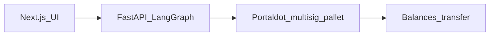

# Sentinel — Portaldot Multisig Treasury Copilot

> Natural-language treasury requests → AI validates & proposes → Portaldot 2-of-3 multisig → human approves → POT moves on-chain.

**Hackathon:** [Portaldot Online S1](https://dorahacks.io/hackathon/portaldot-online-s1/buidl) · **Built with Portaldot**

## Demo video

> Record your 90–180s screencast and embed the YouTube/Vimeo URL here before submission.

## Problem

Treasury teams want AI to draft payments, but a single hot key is a catastrophic risk. Approvals must be enforced on-chain, not in a spreadsheet.

## Solution

**Sentinel** is a LangGraph agent that parses payment intents, runs demo risk checks, and submits **`Multisig.asMulti`** proposals to Portaldot. A second signer finalizes the transfer — the chain enforces threshold 2-of-3, not the LLM.

## Architecture



## Portaldot primitives used

| Primitive | Role |
|-----------|------|
| **multisig pallet** | Load-bearing — `asMulti` propose + finalize |
| **balances pallet** | `transfer_keep_alive` from multisig account |
| **LAO NPoS chain** | Runs on Portaldot Layer-0 dev node (POT, ss58 42) |

## Tech stack

| Layer | Technology |
|-------|------------|
| Agent | LangGraph + optional Claude |
| Backend | FastAPI, substrate-interface |
| Frontend | Next.js 14, Tailwind, shadcn-style UI |
| Chain | Portaldot dev node, Polkadot.js extension (wallet connect) |

## Setup (≤5 commands)

```bash
git clone <your-repo> && cd portaldot-sentinel
bash scripts/download_portaldot_node.sh && bash scripts/start_portaldot_node.sh &
python3.12 -m venv .venv && source .venv/bin/activate
pip install -r backend/requirements.txt && PYTHONPATH=. uvicorn backend.main:app --port 8000 &
cd frontend && npm install && npm run dev
```

Verify chain integration:

```bash
PYTHONPATH=. python scripts/proof_of_life_multisig.py
```

Open http://localhost:3000 — propose a payment, then approve at `/approvals`.

## Built with Portaldot — integration snippet

```python
# scripts/proof_of_life_multisig.py — Multisig.asMulti on Portaldot
call1 = substrate.compose_call("Multisig", "as_multi", {
    "threshold": 2,
    "other_signatories": other_sigs(alice),
    "maybe_timepoint": None,
    "call": payment_call,
    "store_call": False,
    "max_weight": substrate.get_payment_info(payment_call, alice)["weight"],
})
receipt = substrate.submit_extrinsic(
    substrate.create_signed_extrinsic(call=call1, keypair=alice),
    wait_for_inclusion=True,
)
```

## Roadmap

- ink! escrow contracts when Portaldot ships Contracts API v9+
- Policy packs per DAO role
- Mainnet deployment (`wss://mainnet.portaldot.io`)
- Full browser-side `approveAsMulti` via Polkadot.js (currently demo finalize via Bob signer)

## License

MIT
